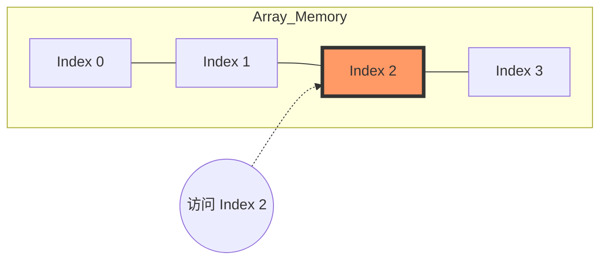
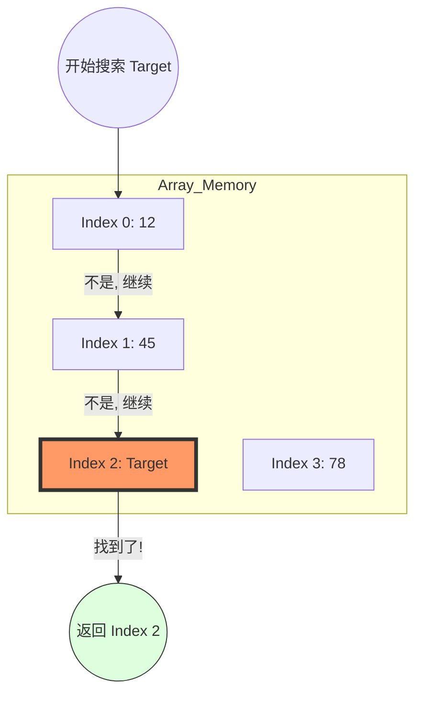
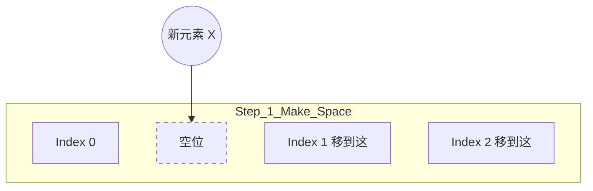
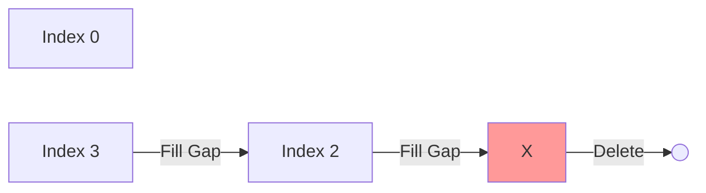

# 📦 数据结构：Array (数组)

> **Vibe**: 数组是算法世界的“一号公路”。它是最简单、最直观的线性存储方式，也是所有高阶结构的基石。

---

## 1. 核心定义 (The Essence)
- **物理底层**: 数组在内存中是一段**连续**的地址空间。
- **随机访问**: 因为地址连续，只要知道起始位置和索引，就能在 $O(1)$ 时间内定位到任何元素。
- **静态 vs 动态**: 
  - 传统数组大小固定。
  - **Python List** 是动态数组，它会自动扩容，但扩容时会有 $O(n)$ 的平摊开销。

---

## 2. 复杂度分析 (Complexity)

| 操作 | 复杂度 | 说明 |
| :--- | :--- | :--- |
| **Access (访问)** | $O(1)$ | 知道 Index 瞬间即达。 |
| **Search (搜索)** | $O(n)$ | 挨个找，除非数据是有序的（可用二分查找）。 |
| **Insertion (插入)** | $O(n)$ | 在头部或中间插入，后面的元素都要“挪窝”。 |
| **Deletion (删除)** | $O(n)$ | 删掉一个，后面的要全体前移填补空位。 |

# 🎬 Array 动态视觉指南 (Visual Array)

> **Vibe**: 数组是内存里的一排“储物柜”。通过这些动图，你可以直观感受到 $O(1)$ 与 $O(n)$ 的本质区别。

---

## 1. 访问 (Access) —— $O(1)$
**逻辑**：通过 Index 直达。就像你有每个储物柜的钥匙。


## 2. 搜索 (Search) —— $O(n)$
**逻辑**：在数组中寻找目标值 `Target`。由于数组无序，必须从 Index 0 开始逐个比对，直到命中或遍历结束。



## 3. 插入 (Insertion) —— $O(n)$
**逻辑**：在 Index 1 插入元素 X，Index 1 及之后的全部都要向后“挪窝”。



## 4. 删除 (Deletion) —— $O(n)$
**逻辑**：删掉 Index 1 后，Index 2 和 3 必须向前填补空位。



---

## 💡 凌影的“逻辑同步”：为什么我们要关心这些动图？

1. **直观感受复杂度**：
   - 看到那些元素一个个往后挪了吗？那就是 **$O(n)$** 的物理代价。
   - 看到直接跳到某个位置了吗？那就是 **$O(1)$** 的物理优势。

2. **面试防坑**：
   - 如果面试官问：“为什么不在数组开头频繁插入数据？”
   - 你脑子里只要浮现出上面那个“集体搬家”的动图，你就能脱口而出：“因为这会导致大量的元素移动，时间复杂度是 $O(n)$。”

---
> **"Mischief Managed."** —— 视觉信号已加载，逻辑已固化。
> 
---

## 3. Google 面试高频“步法” (Common Patterns)

数组题很少考你怎么存，重点考你怎么“走”：

### A. 双指针 (Two Pointers)
- **相向而行**: 一个在头，一个在尾。适合处理有序数组求和、反转。
- **同向而行 (快慢指针)**: 适合处理原地去重、移动零。

### B. 滑动窗口 (Sliding Window)
- **逻辑**: 维护一个左边界 `L` 和右边界 `R`。
- **场景**: 寻找“最长”、“最短”或“符合条件”的子数组。

### C. 前缀和 (Prefix Sum)
- **逻辑**: 预处理一个 `sum` 数组，`sum[i]` 存储前 `i` 个元素的总和。
- **场景**: 快速计算任意区间 $[i, j]$ 的和。

---

## 4. Python 3 实战工具箱

```python
# 1. 初始化
nums = [0] * 10  # 创建一个长度为10且全为0的数组

# 2. 遍历 (带着索引和值)
for i, val in enumerate(nums):
    print(f"Index: {i}, Value: {val}")

# 3. 切片 (Slicing) - 极其强大
sub_arr = nums[1:4]  # 获取索引 1 到 3 的子数组
reversed_arr = nums[::-1]  # 翻转数组

# 4. 排序
nums.sort()  # 原地排序，Timsort 算法，O(n log n)
