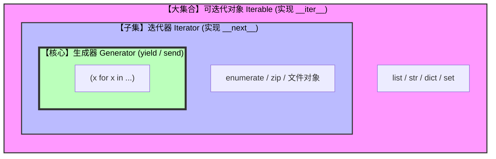

# 《数据结构与算法》Chapter 1 —— Python入门

> **定义堆叠**：一切从用人话理解各种Python基础定义开始。本文基于Python3编写！！！

这一章是整个 Python 知识体系的地基。

<details>
<summary> 🏗️ A. Python 解释器：代码背后的“同声传译” </summary>

### 1. 核心定义
**Python 解释器 = 语法检查器 + 字节码编译器 + 虚拟机 (PVM)**。
它不仅仅是一个简单的翻译官，更是一个完整的运行时环境。没有它，`.py` 文件只是一堆普通的文本，也就是源代码。

---

### 2. 工作流程：两步走战略
Python 并不是直接将源码翻译成二进制，而是经历了一个中间过程，这种设计平衡了开发效率和运行性能。

1. **第一步：编译成字节码 (Bytecode)**
   - 当运行 `.py` 文件时，解释器先进行语法检查。
   - 随后将其编译为一种中间格式——**字节码**（通常存放在 `__pycache__` 文件夹下的 `.pyc` 文件中）。
   - **特点**：字节码是平台无关的，它比源码更接近机器语言，但仍需进一步处理。

2. **第二步：在虚拟机 (PVM) 中运行**
   - 解释器内部集成了 **Python 虚拟机 (Python Virtual Machine)**。
   - PVM 会逐行读取字节码，并将其翻译成当前操作系统和 CPU 能够理解的机器指令。

---

### 3. 语言哲学：“解释型” vs “编译型”
为了理解 Python 的特性，我们可以用“翻译菜谱”来做类比：

| 特性 | 编译型语言 (如 C++/Go) | 解释型语言 (如 Python) |
| :--- | :--- | :--- |
| **类比** | 厨师先将整份菜谱翻译成外语并印成书 | 随身携带一名同声传译，读一句翻一句 |
| **运行产物** | 直接生成 `.exe` 或二进制执行文件 | 运行时实时翻译，不生成独立机器码 |
| **优点** | 运行速度极快 | **调试极其方便**；支持交互式编程 (REPL) |
| **缺点** | 修改代码后需重新编译整本书 | 速度相对较慢（因为多了实时翻译的开销） |

---

### 4. 常见的解释器种类
我们平时安装的 Python 只是解释器的一种实现，根据底层的不同，还有很多变种：

* **CPython**：官方标准版本，用 C 语言实现。它是使用最广泛、兼容性最好的解释器。
* **PyPy**：追求极致速度。采用了 **JIT (Just-In-Time)** 动态编译技术，对长时间运行的循环优化非常显著。
* **Jython / IronPython**：分别运行在 Java 平台和 .NET 平台，允许 Python 代码直接调用这些平台的库。

这些其实不重要。。。

---

### 5. 实操细节：环境变量 (PATH) 与报错
**现象**：为什么在命令行输入 `python` 有时会报“命令未找到”？
**本质**：电脑不知道“翻译官”（`python.exe`）住在哪个文件夹里。
**解决**：设置 **环境变量 (PATH)**。这相当于给电脑一张“地图”，告诉它：*“如果我叫 python，请去这些路径下寻找对应的解释器程序。”*

### 6. 🕵️ 寻找“翻译官”：Python 解释器到底藏在哪？

既然解释器是一个真实存在的程序，我们完全可以把它从硬盘里“揪”出来。以下是几种寻找它的方法：

#### （1） 用代码“自报家门”（最快的方法）
如果你已经打开了编辑器或终端，直接输入这两行代码，解释器会告诉你它的绝对路径：

```python
import sys
print(sys.executable)
```
**Windows 典型路径:**： C:\Users\YourName\AppData\Local\Programs\Python\Python39\python.exe
**macOS/Linux 典型路径:** /usr/local/bin/python3

#### （2） 用代码“自报家门”（最快的方法）

在命令行里寻找
如果你的终端可以直接运行 python，说明它已经在系统的“地图”（PATH 环境变量）里了：

Windows (CMD/PowerShell): 输入 where python
macOS / Linux: 输入 which python3

#### （3）解释器目录的“解剖图”
当你顺着路径找到 Python 的安装文件夹时，你会发现解释器并不是孤身一人，而是一个分工明确的“团队”：

| 文件/文件夹 | 角色说明 |
| :--- | :--- |
| **`python.exe`** | **真正的解释器主体**。一切“翻译”和执行工作都由它完成。 |
| **`pythonw.exe`** | **“安静版”解释器**。运行它时不会弹出黑色命令行窗口，常用于运行图形界面程序或后台服务。 |
| **`Lib` 文件夹** | **“标准库”仓库**。存放着 Python 自带的各种工具包（如 `os`, `sys`, `math`），你平时 `import` 的基础包都在这里。 |
| **`Scripts` 文件夹** | **助手程序集**。存放着各种扩展工具，比如最著名的包管理器 **`pip`** 就住在这里。 |

#### （4） 形象总结：谁才是真正的“大脑”？
为了彻底理清代码运行的关系，我们可以用“**演戏**”来做一个精妙的类比：

> #### 🎭 编程的“剧场理论”
> 
> * **`.py` 文件 (脚本)** 📜
>   * **身份**：**剧本**。
>   * **本质**：它只是文本文件，本身没有生命，没法自己动。它规定了“剧情”该如何发展。
> 
> * **Python 解释器 (`python.exe`)** 👨‍🎤
>   * **身份**：**演员**。
>   * **本质**：他是活的。他负责读懂“剧本”，并在舞台（内存/CPU）上把它真实地演出来。没有演员，剧本永远只是一叠纸。
> 
> * **PyCharm / VS Code (IDE)** 🏛️
>   * **身份**：**剧院**。
>   * **本质**：它们提供了灯光、音响、舒适的座椅和排练室（代码高亮、调试器、自动补全）。它们让演戏的过程更顺畅，但核心任务依然是调用“演员”来执行“剧本”。


---

### 💡 关键结论
我们在 IDE（剧院）里写下 `.py` 文件（剧本），最终都要交给 `python.exe`（演员）去翻译给计算机硬件听。理解了这一点，你就明白了为什么有时候换了编译器（剧院），程序运行结果还是一样——因为**演员（解释器）**没换。
---

### 💡 深度思考：为什么算法库常用 C 语言写？
由于 Python 解释器是“逐行解释”的，其原生运行速度在处理海量数据时（如深度学习、大规模矩阵运算）会遇到瓶颈。

因此，像 **NumPy**、**Pandas** 这样的库，其底层核心逻辑是用 **C 语言** 编写并预编译好的。Python 在这里更像是一个**调度员**：利用其第一类对象的灵活性编写逻辑，但在计算重活儿时，直接调用 C 语言写好的高性能“机器码”，从而实现了“开发快”和“运行快”的完美统一。


</details>

> **为啥用它**：在学习 Python 的过程中，我们编写的是人类可读的源码，但计算机 CPU 只能听懂二进制指令（0 和 1）。这中间衔接的桥梁就是 **Python 解释器 (Interpreter)**，Python 解释器，一个可执行的程序文件（在 Windows 上是 python.exe，在 macOS 或 Linux 上就是 python）简单来说就是个破软件，用来执行.py源代码的。

--------------------------------------------------------------------------------------------------------------------------------------

<details style="margin-left: 20px;">
<summary>  🏗️ B. Python 类和对象的定义 </summary>
    
> **核心笔记：**
> 在 Python 中，“变量”并不是存储数据的盒子，而是指向内存中对象的“标签（引用）”。理解这一层“名实分离”是掌握 Python 内存机制的关键。

## 灵魂拷问：究竟什么是类？究竟什么是对象？

> **注释：** Python 的核心思想是“面向对象编程”（OOP），它通过模拟现实世界来组织代码。理解了类与对象的关系，就理解了 Python 处理数据的逻辑。

### 1. 核心定义：模具 vs 产品
* **类 (Class)**：是一个**抽象**的概念，是定义某种事物的**模板/蓝图**。它规定了这类事物应该“长什么样”（属性）以及“能做什么”（方法）。
* **对象 (Object/Instance)**：是根据类模板创造出来的**具体实体**（也叫实例）。

#### 🎭 形象比喻：月饼模具
- **类**：是月饼的**模具**。它决定了月饼的形状和花纹，但它本身不能吃。
- **对象**：是按照模具压出来的**一个个真实的月饼**。你可以有豆沙月饼、莲蓉月饼，它们虽然口味不同，但都来自同一个模具。

---

### 2. 类里面装了什么？（构成要素）
一个完整的类通常包含两个核心维度，用来描述一个完整的物体：

1.  **属性 (Attributes)**：
    - **定义**：描述事物的**特征**（它是“什么”）。
    - **例子**：汽车的颜色、品牌、排量。
2.  **方法 (Methods)**：
    - **定义**：描述事物的**行为**（它“能做什么”）。
    - **例子**：汽车的行驶、刹车、鸣笛。

---

### 3. 回到 Python：类型即是类 (Type is Class)
在 Python 中，所有你常用的基础类型（int, str, list）本质上都是 Python 预先写好的“内置类”。

* **当你写 `x = 10` 时**：你实际上是根据 `int` 这个类（蓝图），创造了一个值为 10 的**对象**。
* **当你写 `s = "hello"` 时**：你创造了一个 `str` 类的**对象**。因为 `str` 类里定义了 `upper()` 方法，所以你才能执行 `s.upper()`。

---

### 4. 为什么要发明“类”？（工程学的艺术）
如果没有类，管理大量复杂数据会引发灾难。类的存在带来了三大好处：
* **封装 (Encapsulation)**：把数据和操作函数打包。你只需要知道怎么开车，不需要知道引擎活塞的具体运动。
* **代码复用**：定义一次“猫”类，就可以生成无数只“猫”对象。
* **分类管理**：让代码像生物学分类一样井然有序，而不是一摊乱麻。

---

### 5. 💡 我的深度感悟：到底什么是对象？

通过拆解，我发现对象并不是一个简单的值，而是一个**内存实体**：
1.  **对象由三部分组成**：标识 (ID)、类型 (Type)、值 (Value)。
2.  **对象是“实”，变量是“名”**：对象是内存里的人，变量是贴在他身上的绰号。
3.  **万物皆对象**：在 Python 里，连“类”本身也是一个对象，这种极简的对称美是 Python 强大的根源。

> **一句话总结**：类是“人类”这个抽象概念，而对象就是“此时此刻正在写笔记的你”。


### 1. 对象的“三要素”
每一个 Python 对象在被创建时，都会被分配三个核心属性：

| 属性 | 说明 | 查看方式 | 形象理解 |
| :--- | :--- | :--- | :--- |
| **标识 (Identity)** | 对象在内存中的唯一地址 | `id(obj)` | 对象的“身份证号” |
| **类型 (Type)** | 决定对象可以做什么（如 int, list） | `type(obj)` | 对象的“物种/说明书” |
| **值 (Value)** | 对象代表的数据内容 | `print(obj)` | 对象的“长相/内容” |

---

### 2. “标签”逻辑：变量赋值的本质
在 Python 里，执行 `a = [1, 2, 3]` 时，发生的并不是“塞入”，而是“绑定”：
1.  **创建对象**：在内存中开辟空间，生成一个列表对象 `[1, 2, 3]`。
2.  **贴上标签**：把名称 `a` 关联到这个对象的地址上。

#### 别名 (Aliasing) 与副作用
如果你执行 `b = a`，实际上是把标签 `b` 也贴到了**同一个**对象上：
- **实验**：执行 `a.append(4)`，你会发现 `b` 竟然也变成了 `[1, 2, 3, 4]`。
- **原理**：因为 `a` 和 `b` 只是同一个物体的两个不同称呼（别名）。在修改可变对象（如列表）时，所有指向它的标签都会看到变化。

---

### 3. `is` 与 `==` 的终极区别
这是新手最容易踩坑的地方，在总结里一定要记清：
* **`==` (相等)**：检查两个对象的值（Value）是否一样。
* **`is` (同一)**：检查两个变量是否指向同一个对象（ID 是否一样）。

```python
  a = [1, 2]
  b = [1, 2]
  print(a == b) # True，因为内容长得一模一样
  print(a is b) # False，因为它们是两块独立的内存空间
  
  c = a
  print(c is a) # True，因为 c 就是 a 的别名，地址完全一致
```

---

### 4. 可变性 (Mutability) 哲学
Python 将对象严谨地分为两类，这决定了它们在内存中的表现：

1.  **不可变对象 (Immutable)**：
    - **种类**：`int`, `float`, `str`, `tuple`, `bool`。
    - **特点**：像刻在石头上的字。如果你让 `x = 1` 变为 `x = 2`，Python 并不是修改了“1”那块内存，而是**重新找了一块刻着“2”的内存，把标签 x 换贴过去**。
2.  **可变对象 (Mutable)**：
    - **种类**：`list`, `dict`, `set`。
    - **特点**：像草稿纸，支持“原地修改”（In-place modification）。

**💡 为什么重要？**
不可变对象是天生线程安全的，且可以作为字典的 **Key**。如果 Key 是可变的，一旦内容变了，Python 的哈希系统就再也找不到对应的 Value 了。

---

### 5. 第一类对象 (First-class Object)
在 Python 哲学里，**“一切皆对象”**。这意味着函数（Function）和类（Class）也是对象。
- 它们可以被赋值给变量：`f = print`
- 它们可以作为参数传递给其他函数。
- 它们拥有自己的属性和方法。

这种“万物平等”的设计让 Python 变得极其灵活。

#### 🔍 深度思辨：类型、值与对象的关系
在手搓笔记时，我曾产生过一个疑问：类型是不是就是类？值是不是就是对象？经过拆解发现：

1. **类型 (Type) == 类 (Class)**：
   - 它是对象的“说明书”。例如 `type(10)` 返回 `<class 'int'>`，说明 10 是 int 类的一个实例。

2. **对象 (Object) ≠ 值 (Value)**：
   - **对象**是内存中的一个**实体**，它像一个“信封”。
   - **值**是信封里的“**信件内容**”。
   - 两个不同的信封（不同的 ID）里可以装两封内容完全一样的信（相同的 Value）。

3. **第一类对象 (First-class Object) 的真正含义**：
   - 既然类也是对象，那么“类”本身也有自己的 ID、Type 和 Value。这体现了 Python “万物皆对象”的极简哲学。

---

> 一些没什么用但是不是不值一提的定义们：

### a. 标识符之揭秘赋值语句：temp = temp + 5.0

执行加法运算后，是原来的对象变大了吗？不！是标签换了主人。

#### 1. 标识符 (Identifier) 的定义
标识符是关联到对象的**名称**。它像是一张标签，通过“赋值运算符 `=`”贴在对象上。

#### 2. 运算背后的内存交换
对于 `temp = temp + 5.0`：
1. **旧对象**：原本 `temp` 指向 ID 为 `001` 的对象（值为 10.0）。
2. **新对象**：运算产生了 ID 为 `002` 的新对象（值为 15.0）。
3. **重定向**：标识符 `temp` 的**引用关系**发生了变化，它从 `001` 指向了 `002`。

#### 3. 总结：变与不变
* **不变的是**：标识符的名字（依然叫 `temp`）。
* **变化的是**：标识符所关联的**对象实体**（ID 变了）。

**💡 启示**：在 Python 中，赋值语句 `=` 的本质是**修改引用的指向**，而不是修改对象的内容（除非操作的是可变对象，如列表的索引赋值）。

### b. 实例化&方法调用
核心逻辑：实例化是把抽象的类变成内存中具体的对象。调用是让具体的对象执行类中定义的技能。

#### 1. 实例化 (Instantiation)
**格式**：`obj = ClassName()`
**本质**：这是“对象”诞生的时刻。解释器根据类的模板在内存中分配空间，并返回该空间的引用。
* **比喻**：根据建筑图纸（类）真正盖起了一栋大楼（对象）。

#### 2. 方法调用 (Method Invocation)
**格式**：`对象.方法名()`
**语法逻辑**：`Who.Do_Something()`
* **为什么需要点号？** 因为方法是绑定在对象身上的。点号告诉 Python：“去这个对象的命名空间里查找这个函数并执行它”。
* **参数传递隐喻**：
  当你执行 `my_list.append(5)` 时，Python 实际上是把 `my_list` 自己作为第一个参数传给了 `append` 函数（这就是类定义中 `self` 的来源）。

#### 3. 对比总结
| 术语 | 动作 | 结果 |
| :--- | :--- | :--- |
| **实例化** | `c = Cat()` | 创造了一个实体 |
| **方法调用** | `c.meow()` | 实体执行了一个动作 |

### c. 类的家族：内置 vs 自定义

核心发现：Python 的世界不只有 int 和 list，我们还可以“造物”。

#### 1. 内置类 (Built-in Classes)
* **身份**：由 Python 官方预设，随解释器启动即存在。
* **特点**：处于 `built-in` 作用域，无需 `import` 即可使用。
* **代表**：`int`, `float`, `list`, `tuple`, `dict`, `set`, `str`。

内置类可以按照以下方式分类：

##### 📚 Python 内置类大汇总

> | 类别 | 类名 (Class) | 描述 (Description) | 语法示例 (Syntax) | 可变性 (Mutability) |
> | :--- | :--- | :--- | :--- | :--- |
> | **基础布尔** | `bool` | 布尔值（真或假） | `True`, `False` | 不可变 |
> | **数字族** | `int` | 任意精度的整数 | `10`, `-5` | 不可变 |
> | | `float` | 浮点数（带小数） | `3.14`, `2.0` | 不可变 |
> | | `complex` | 复数 | `3 + 5j` | 不可变 |
> | **序列族 (Sequence)** | `list` | 可变序列（最常用） | `[1, 2, 3]` | **可变** |
> | | `tuple` | 不可变序列（元组） | `(1, 2, 3)` | 不可变 |
> | | `str` | 字符序列（字符串） | `'hello'`, `"hi"` | 不可变 |
> | **二进制序列** | `bytes` | 不可变字节序列 | `b'raw data'` | 不可变 |
> | | `bytearray` | 可变字节序列 | `bytearray(5)` | **可变** |
> | **集合族 (Set)** | `set` | 无序且不重复的集合 | `{1, 2, 3}` | **可变** |
> | | `frozenset` | 不可变集合 | `frozenset([1, 2])` | 不可变 |
> | **映射族 (Map)** | `dict` | 键值对映射（字典） | `{'a': 1, 'b': 2}` | **可变** |

##### 💡 深度笔记：如何一眼区分它们？

> 在手搓这些类的总结时，可以参考以下三个维度进行分类，这会让你的笔记更有深度：

> 1. **容器 (Container) 还是 标量 (Scalar)？**
>   - **标量**：`int`, `float`, `bool`。它们只代表一个简单的、不可分割的值。
>   - **容器**：`list`, `tuple`, `set`, `dict`。它们像仓库，里面可以装很多其他对象（甚至装另一个容器）。

> 2. **可变性 (Mutability) 的实战意义**
>   - **可变对象 (`list`, `set`, `dict`)**：支持“原地修改”。就像在原有的草稿纸上改字，地址（ID）不变。
>   - **不可变对象 (`str`, `tuple`, `int`)**：不支持修改。如果你想改，Python 必须创建一个全新的对象（分配新 ID），然后把标签贴过去。

> 3. **序列 (Sequence) 的有序性**
>   - `list`, `tuple`, `str` 是有顺序的，你可以通过索引（如 `[0]`）来精准定位。
>   - `set` 和 `dict` 在逻辑上是无序的。你不能说“字典的第一个元素是什么”，你只能问“键为 'a' 的值是什么”。


##### 🔧 特殊对象：None

> 图中还提到了 `None`。它属于 `NoneType` 类。
>   - **作用**：它是一个“单例对象”，全 Python 只有一个 `None`。
>   - **比喻**：它代表“真空”或“空位”，常用来表示函数没有返回值或者变量还没被初始化。

#### 2. 自定义类 (User-defined Classes)
* **身份**：程序员通过 `class` 关键字定义的蓝图。
* **价值**：允许我们根据业务需求（如：银行账户、游戏角色）创建特定的数据类型。

#### 3. 第三方类 (Third-party Classes)
* **身份**：由开源社区贡献，需通过 `pip` 安装并 `import` 导入。
* **代表**：`numpy.ndarray`, `pandas.DataFrame`。

**💡 总结**：无论来源如何，在 Python 解释器看来，它们在内存中的存储结构（ID, Type, Value）是完全一致的，都遵循“万物皆对象”的法则。
    
</details>

> **WHATEVER**：不管你有没有对象，反正Python有，还不止一个。厉害不厉害？不仅有对象，还会面向对象！还一切皆对象！

--------------------------------------------------------------------------------------------------------------------------------------

<details style="margin-left: 20px;">
<summary>  🏗️  C. 表达式、运算符与优先级 </summary>

### 1. 表达式 (Expression) 的本质
表达式不仅仅是 `1 + 1`。在 Python 中，任何能产生“值”的东西都是表达式：
* **字面量**：`5.0`
* **标识符**：`temp`
* **运算组合**：`temp + 5.0`
* **函数调用**：`abs(-10)`

---

### 2. 常用运算符全族谱
根据你提供的内置类图，Python 的运算符主要分为以下几类：

#### (1) 算术运算符
> | 运算符 | 描述 | 示例 | 重点说明 |
> | :--- | :--- | :--- | :--- |
> | `+`, `-`, `*` | 加、减、乘 | `5 * 2` | 基础运算 |
> | `/` | **真除法** | `5 / 2 = 2.5` | **结果永远是浮点数** |
> | `//` | **整除** | `5 // 2 = 2` | 向下取整 |
> | `%` | 取模（余数） | `5 % 2 = 1` | 常用于判断奇偶 |
> | `**` | 幂运算 | `2 ** 3 = 8` | $2^3$ |

#### (2) 比较运算符（返回布尔值）
> * `<`, `<=`, `>`, `>=`：大小比较。
> * `==`：值相等比较。
> * `!=`：值不等比较。
> * `is` / `is not`：**标识（ID）比较**。

#### (3) 逻辑运算符
> * `not`：非（取反）。
> * `and`：与（两者都为真）。
> * `or`：或（只要有一个为真）。
> * **短路逻辑**：如果 `a or b` 中 `a` 已经为真，Python 根本不会去算 `b` 是什么。

#### （4） 序列运算符 (Sequence Operators)
> 适用于 `list`, `tuple`, `str` 等有序序列：

> | 运算符 | 描述 | 示例 | 结果 |
> | :--- | :--- | :--- | :--- |
> | **`s[i]`** | 索引访问 | `[1, 2, 3][1]` | `2` |
> | **`s[i:j]`** | 切片（含头不含尾） | `[1, 2, 3, 4][1:3]` | `[2, 3]` |
> | **`s + t`** | 序列拼接 | `[1, 2] + [3]` | `[1, 2, 3]` |
> | **`s * n`** | 序列重复 | `[0] * 3` | `[0, 0, 0]` |
> | **`val in s`** | 成员检查（包含） | `2 in [1, 2]` | `True` |
> | **`val not in s`** | 成员检查（不包含） | `4 not in [1, 2]` | `True` |
> | **`s < t`** | 字典序比较 | `'abc' < 'abd'` | `True` |


#### （5）  集合与字典运算符 (Set & Dict Operators)

> #### (1) 集合 (set) 专用
> 集合运算符基于数学中的集合论，非常适合做数据去重和逻辑筛选：
> * **并集 `|`**：`s | t`（包含 s 和 t 中所有元素的新集）
> * **交集 `&`**：`s & t`（同时属于 s 和 t 的元素）
> * **差集 `-`**：`s - t`（在 s 中但不在 t 中的元素）
> * **对称差集 `^`**：`s ^ t`（只属于其中一个集合的元素）
> * **子集比较**：`<`, `<=`, `>`, `>=`（判断包含关系）

> #### (2) 字典 (dict) 专用
> * **键值访问 `d[key]`**：获取指定键对应的值。
> * **成员检查 `key in d`**：检查某个**键 (Key)** 是否存在。
> * **合并 `|`**：`d1 | d2`（Python 3.9+ 引入，返回合并后的新字典）。

#### (6) 扩展赋值运算符 (Extended Assignment)
> 将运算与赋值合并，格式为 `变量 运算符= 值`：

> | 运算符 | 等价于 | 适用范围 |
> | :--- | :--- | :--- |
> | **`a += b`** | `a = a + b` | 数字加法、序列拼接 |
> | **`a -= b`** | `a = a - b` | 数字减法、集合差集 |
> | **`a *= b`** | `a = a * b` | 数字乘法、序列重复 |
> | **`a |= b`** | `a = a | b` | 集合并集更新、字典合并更新 |

**💡 深度思考：原地修改 (In-place)**
对于**可变对象**（如 `list`），`a += b` 往往比 `a = a + b` 更高效。
- `a = a + b`：创建一个全新的列表，把两边拷贝进去。
- `a += b`：直接在原列表末尾追加元素（类似 `extend`），**不改变 ID**，速度更快。

---

### 3. 优先级：谁先上场？
当一个表达式里挤满了运算符时（如 `result = 5 + 3 * 2 > 10 and True`），Python 遵循严格的先后顺序：

| 优先级 | 运算符类型 | 典型代表 |
| :--- | :--- | :--- |
| **1 (最高)** | 括号 | `( )`（永远最优先，不确定就加括号） |
| **2** | 幂运算 | `**` |
| **3** | 乘除取余 | `*`, `/`, `//`, `%` |
| **4** | 加减 | `+`, `-` |
| **5** | 比较运算 | `<`, `>`, `==`, `is`, `in` |
| **6** | 逻辑非 | `not` |
| **7** | 逻辑与 | `and` |
| **8 (最低)** | 逻辑或 | `or` |

---

### 4. 💡 深度避坑指南

#### ① 浮点数的精度误差
在笔记里可以记下这个有趣的现象：
```python
print(0.1 + 0.2 == 0.3)  # 结果居然是 False！
```

原因：二进制表示小数会有微小误差。在算法中比较浮点数，建议用 abs(a - b) < 1e-9。

#### ② 链式比较
Python 支持 1 < x < 10 这种写法，这等同于 (1 < x) and (x < 10)。这让代码非常易读。

#### ③ 赋值不是表达式
在 Python 3.8 之前，赋值 a = 1 是一个语句，没有返回值。这就是为什么你不能写 if (a = 5) > 0:。
(注：3.8 之后引入了海象运算符 := 解决了这个问题，但在初学者阶段建议先搞清楚 = 的纯赋值属性)

---

### Question: 为什么int, list, float这些，即是类，又是对象？

> **核心结论：** 在 Python 的世界里，没有绝对的“模具”与“产品”之分。遵循“一切皆对象”的准则，连“类（模具）”本身也是被造出来的。

#### 1. 逻辑链条：三层套娃架构
理解这个问题的关键在于理清“谁是谁的实例”：

> 1.  **第一层：具体的实例对象**
    - 比如数字 `10`。它是根据 `int` 类的蓝图制造出来的。
> 2.  **第二层：内置类（模具）**
    - 比如 `int`, `list`, `float`。它们定义了数字或列表的行为。
    - **惊人真相**：在内存中，`int` 也是一个实体，拥有自己的 ID。它其实是 `type` 类的**对象**。
> 3.  **第三层：元类 (Metaclass)**
    - 即 **`type`**。它是 Python 权力的巅峰，负责制造所有的“类”。

---

#### 2. 内存实验证明
在终端输入以下代码，你会亲眼看到这个“套娃”过程：

```python
   # 1. 检查数字 10 的类
   print(type(10))    # 输出: <class 'int'>
   
   # 2. 检查 int 自己的类
   print(type(int))   # 输出: <class 'type'>
   
   # 3. 检查 type 自己的类 (终极套娃)
   print(type(type))  # 输出: <class 'type'> -> 它竟然是它自己的对象！
```

#### 3. 形象比喻：月饼生产线
为了彻底搞懂 `type`、`class` 和 `instance` 的关系，我们可以观察这条生产线：

* **`type` (元类)** ⚙️：
    - **身份**：**月饼模具制造机**。
    - **职责**：它是最底层的机器，专门用来生产各式各样的“模具”。
* **`int` / `list` (类)** 🏗️：
    - **身份**：由制造机生产出来的**月饼模具**。
    - **双重地位**：对于制造机来说，它是“产品”（对象）；对于面团来说，它是“蓝图”（类）。
* **数字 `10` / 列表 `[1, 2]` (实例对象)** 🥮：
    - **身份**：由模具压出来的**真实月饼**。
    - **职责**：它们是最终在程序中被消耗、处理的数据实体。


#### 4. 这种“极简设计”的实战价值
为什么 Python 解释器要费劲把“类”也做成对象？因为它带来了三大好处：

##### ① 极高的灵活性 (Flexibility)
你可以把 `list` 或 `int` 像普通变量一样操作。
- **示例**：你可以把一个“类”当作参数传给函数。比如写一个工厂函数，根据传入的类名（模具）来批量生产对象。

##### ② 强大的动态性 (Dynamism)
既然类是对象，就意味着它在程序运行时是“活”的。
- 你可以在程序运行的过程中，动态地给一个类添加新方法，或者修改它的属性，甚至现场通过代码造出一个全新的类。

##### ③ 逻辑的高度统一 (Uniformity)
Python 彻底抛弃了 C++ 或 Java 中“基本数据类型”与“类”的繁琐区别。
- **哲学**：在 Python 解释器眼里，**万物平等，皆为对象**。唯一的区别只是大家在套娃体系中所处的层级不同。这种统一性极大地降低了学习和使用底层的认知负担。


#### 💡 总结感悟
理解了“类也是对象”，我就理解了为什么 Python 能如此简洁。这种**“模具也是产品”**的设计，让 Python 变成了一块极具可塑性的“橡皮泥”，开发者可以随心所欲地定制自己的数据世界。

</details>

-------------------------------------------------------------------------------------------------------------------------------------

<details style="margin-left: 20px;">
<summary>  🏗️  D: 控制流程 (Control Flow) </summary>


### 1. 条件分支：if / elif / else
根据布尔表达式的结果（True/False）来决定执行哪一段代码。

* **语法格式**：
    ```python
    if condition1:
        # 执行语句
    elif condition2:
        # 执行语句
    else:
        # 执行语句
    ```
* **重点**：`elif` 是 `else if` 的缩写。一旦某个分支满足条件，后续的分支将不再被检查。


---

### 2. while 循环：条件驱动
只要条件为真，代码块就会一遍又一遍地执行。

* **风险点**：必须确保循环体内有能改变条件的语句，否则会导致“死循环”。
* **代码示例**：
    ```python
    while count < 5:
        print(count)
        count += 1
    ```

---

### 3. for 循环：迭代驱动（Python 的核心）
Python 的 `for` 循环本质上是一个 **迭代器（Iterator）** 遍历器。它不是简单的数值计数，而是依次访问容器中的每一个元素。

* **常用场景**：
    * 遍历列表：`for item in [1, 2, 3]:`
    * 配合 `range()`：`for i in range(5):`（生成 0 到 4 的序列）
* **对比感悟**：在 Python 里，能被 `for` 循环的都是“可迭代对象（Iterable）”。

* Python 的 `for` 循环不只是计数器，它是**对象访问器**。只要一个对象是“可迭代的”（Iterable），它就能被 `for` 遍历。

#### （1） 基础用法：遍历序列
这是 `for` 循环最纯粹的形态：直接从容器里提取对象。

```python
# 1. 遍历列表 (List)
fruits = ["apple", "banana", "cherry"]
for fruit in fruits:
    print(f"I like {fruit}")

# 2. 遍历字符串 (String) - 字符串本质是字符序列
for char in "Python":
    print(char.upper())

```

---

### 4. 循环控制：break, continue 与 else
为了更精细地控制循环，Python 提供了三个法宝：

1.  **`break`**：彻底结束当前循环，直接跳出。
2.  **`continue`**：跳过本次循环剩余代码，直接进入下一次循环。
3.  **`else` (循环特有)**：**非常特殊！** 只有当循环**正常结束**（没有被 `break` 强行打断）时，才会执行 `else` 块。
    * *比喻*：如果你“正常坚持”完了训练，就给你奖励（else）；如果你中途“break”逃跑了，奖励取消。

---

### 💡 深度避坑指南：缩进陷阱
* **强制缩进**：Python 官方建议使用 **4 个空格**。千万不要混用空格和 Tab，这会导致 `IndentationError`。
* **冒号不能丢**：每个控制语句（if, while, for）的末尾必须带上冒号 `:`。

### 🔍 深度辨析：for 循环 vs. while 循环

虽然两者都能实现循环，但在 Python 中它们的“性格”完全不同：

| 维度 | for 循环 (迭代驱动) | while 循环 (条件驱动) |
| :--- | :--- | :--- |
| **核心逻辑** | “遍历这个容器里的所有东西” | “只要条件满足，就一直做下去” |
| **无序容器 (set)** | **支持**。通过迭代器直接获取元素。 | **不支持**（因为 set 没有索引，无法用 `i` 递增访问）。 |
| **range 配合度** | **完美搭档**。直接生成序列进行迭代。 | **不匹配**。虽然技术上可行，但逻辑上多此一举。 |
| **适用场景** | 已知循环范围或需要处理容器元素。 | 循环次数未知，仅依赖某个状态改变。 |

###¥ 1. 关于“遍历无序容器 (Set)”：关键在于索引
> * **现象**：`for` 可以轻松遍历 `set`，但 `while` 很难做到。
> * **底层真相**：
    - **`for` 循环**：采用“迭代器协议”。它不关心对象有没有序号，只要是“可迭代”的（如 Set），它就能逐一提取。
    - **`while` 循环**：通常依赖**索引（Index）**。由于 `set` 是无序的，不支持 `s[0]` 这种下标访问，因此无法使用经典的 `while i < len(s)` 模式。
> * **结论**：`for` 是处理无序容器最优雅的工具。

---

#### 2. 关于“range 内置类”：逻辑上的配合度
> * **现象**：`for` 与 `range` 是黄金搭档，而 `while` 几乎不与 `range` 配合。
> * **底层真相**：
>     - **`for` 循环**：天生为“惰性序列”设计，自动处理取值逻辑。
>     - **`while` 循环**：虽然可以使用 `range`，但过程极其笨拙。你必须手动创建迭代器并不断调用 `next()`：
     
```python
   it = iter(range(5))
   while True:
       try:
           x = next(it)
       except StopIteration:
           break
```
> * **结论**：在实战中，`range` 出现在 `while` 里通常意味着代码设计过于冗余。

---

#### 💡 总结感悟：自动挡 vs 手动挡
> - **`for` 循环（自动挡）**：隐藏了复杂的迭代细节（如 `iter()` 和 `next()`），让你专注于数据处理。
> - **`while` 循环（手动挡）**：虽然可以模拟 `for` 的行为，但它的真正价值在于处理**未知循环次数**的逻辑判断（如“只要还没断开连接，就一直监听”）。

#### 💡 我的感悟：
> - **`for` 循环**体现了 Python 的“高层抽象”：你不需要关心数据是怎么存的（有序还是无序），交给 `for...in` 就行。
> - **`while` 循环**更接近“底层逻辑”：它更灵活，但也更容易因为忘记更新条件而导致死循环。

</details>

> **核心笔记：**
> Python基本的控制结构，条件语句和循环语句。

---


<details style="margin-left: 20px;">
<summary>  🏗️  E: 函数，命名空间，作用域与参数 </summary>

### 1. 什么是函数？
> **核心概念：** 如果非要用一句话定义，那就是：函数是封装了一段特定逻辑的、可重复调用的“逻辑包裹”。

> Example：
> # 1. 使用 def 关键字定义函数名

```python
def calculate_discount_price(original_price, discount_rate=0.1):    # -----------------函数的标志
    """
    计算折后价格的函数（这是文档字符串，解释函数功能）
    :param original_price: 原价 (float/int)                          
    :param discount_rate: 折扣率，默认为 0.1 (float)
    :return: 最终价格 (float)
    """
    
    # 2. 内部逻辑运算（主体运行规则）
    if original_price < 0:                                          # -----------------函数的主体
        return 0  # 异常处理：价格不能为负                              # -----------------函数的主体
        
    reduction = original_price * discount_rate                      # -----------------函数的主体
    final_price = original_price - reduction                        # -----------------函数的主体

    # 3. 使用 return 返回结果
    return final_price                                              # -----------------函数的主体

# --- 调用执行 ---
# 场景 A：使用默认折扣（0.1）
price1 = calculate_discount_price(100)
print(f"原价100，默认折后：{price1}")  # 输出 90.0

# 场景 B：指定折扣（0.2）
price2 = calculate_discount_price(200, 0.2)
print(f"原价200，八折后：{price2}")    # 输出 160.0
```

* **`def` (标志)**：告诉 Python，“注意，我要开始打包一段逻辑了！”
* **`calculate_discount_price` (名字)**：你在命名空间（通讯录）里给这段逻辑起的标签。
* **`(original_price, ...)` (形参)**：逻辑运行所需的“原材料”占位符。
* **主体运行规则**：缩进部分的代码。它只在被调用时才跑，平时只是静静地待在内存里。
* **`return` (出口)**：运算结束，把结果吐出来，并把控制权还给主程序。

**💡 结论：**
这段代码证明了你的直觉：函数就是一个**“输入 -> 加工 -> 输出”的独立单元。它不关心是谁调用的它，它只管按既定规则处理传进来的 `original_price`。

---

### 2. 怎么定义命名空间？什么是这个例子下的命名空间？

> **核心概念：** 命名空间不是某一行代码，而是一个看不见的“房间”，它决定了名字（标签）存放的位置以及它们的生存寿命。

### （1） 全局命名空间 (Global Namespace)
当你运行程序时，Python 解释器首先创建的“大房间”。

* **存了什么？**
    * `calculate_discount_price`：函数名本身也是变量，指向那段逻辑包裹。
    * `price1` / `price2`：存储函数执行后的返回结果。
* **生命周期**：从程序启动开始，直到你关闭程序。

### （2） 局部命名空间 (Local Namespace)
当你执行 `calculate_discount_price(100)` 的瞬间，临时盖起的“小房间”。

* **存了什么？**
    * **参数**：`original_price` (100), `discount_rate` (0.1)。
    * **临时变量**：`reduction`, `final_price`。
* **生命周期**：**极其短暂**。一旦 `return` 执行完毕，房间瞬间拆除，内部变量全部消失。
    * *注：这就是为什么在函数外打印 `print(reduction)` 会报错（NameError），因为全局通讯录里根本没有这个名字。*

### 🗺️ 空间分布示意图

```python
# 【此处属于：全局命名空间 (Global)】
# 名字登记：calculate_discount_price

def calculate_discount_price(original_price, discount_rate=0.1):
    # 【此处属于：局部命名空间 (Local)】
    # 名字登记：original_price, discount_rate, reduction, final_price
    
    reduction = original_price * discount_rate
    final_price = original_price - reduction
    return final_price

# 【回到：全局命名空间 (Global)】
# 名字登记：price1, price2
price1 = calculate_discount_price(100)
```
---

### 3. 怎么定义作用域？什么是这个例子下的作用域？

> **核心定义：** 如果说 **命名空间** 是存放名字的“文件夹”，那么 **作用域** 就是规定你在代码的哪个位置、有无权限打开这个文件夹的“规则”。

### （1） 作用域的本质

在你的代码里，作用域规定了：你在第几行代码，能看到哪个文件夹里的名字。

* **全局作用域 (Global Scope)：** 你站在房子的客厅。你可以看到客厅里的所有东西（比如 price1），也可以看到公共设施（内置函数），但你看不见卧室（函数内部）里的私人物品。

* **局部作用域 (Local Scope)：** 你进入了卧室并关上了门。此时你不仅能看到卧室里的东西（比如 reduction），还能透过窗户看到客厅里的东西。


### （2）深度拆解：局部作用域 (Local Scope)

在 `calculate_discount_price` 函数中，局部作用域就像是一个**“阅后即焚”的密室**：

* **密室开启**：当你执行 `calculate_discount_price(100)` 时，密室瞬间建成。
* **成员入驻**：
    * `original_price` 和 `discount_rate` 被反锁在里面。
    * 运行过程中产生的 `reduction` 和 `final_price` 也只在这个密室里活动。
* **密室外的人**：处于“全局作用域”的人看不见密室里的 `reduction`。
    * *注：如果你在外面尝试 `print(reduction)`，Python 会抛出 `NameError`。*
* **密室坍塌**：一旦 `return` 语句执行，将结果扔出后，整个局部作用域连同里面的变量标签会被**全部回收销毁**。

### （3） 📂 作用域的“单向透明”原则
这是 Python 变量访问的最核心逻辑：

1. **从里看外（透明）**：
   在局部作用域（函数内）可以看见并访问全局变量。
2. **从外看里（不透明）**：
   在全局作用域看不见、也无法直接访问局部变量。

```python
# --- 全局作用域（客厅） ---
# 这里的人能看到：calculate_discount_price, price1

def calculate_discount_price(original_price, discount_rate=0.1):
    # --- 局部作用域（卧室） ---
    # 这里的代码能看到：
    # 1. 自己房间的：original_price, reduction, final_price
    # 2. 客厅（全局）的：虽然这个例子没用，但它确实能看到客厅的东西
    
    reduction = original_price * discount_rate
    final_price = original_price - reduction
    return final_price

# 这里尝试 print(reduction) 会报错！
# 理由：你回到了全局作用域（客厅），你的“视野”里没有这个名字。
```

### 💡 我的感悟：
作用域的存在不仅是为了节省内存（用完即焚），更是为了**隔离干扰**。它确保了函数内部的“逻辑密室”不会被外部干扰，也保证了外部的“公共空间”不会被层出不穷的局部变量堆

### 4. 函数的参数
> **核心概念：** 如果非要用一句话定义，那就是：函数是封装了一段特定逻辑的、可重复调用的“逻辑包裹”。

参数的艺术：默认、关键字与可变参数</summary>

> **核心笔记：** Python 的参数系统极其灵活，它允许你在调用函数时像“填空”一样简单，也可以像“配置表”一样复杂。

---

#### 1. 默认参数值 (Default Arguments)
在定义函数时直接给参数赋值。如果调用时不传，就用这个默认值。

* **代码示例**：
 ```python
    def greet(name, msg="Morning"):
        print(f"Good {msg}, {name}!")
   
    greet("Alice")           # Good Morning, Alice!
    greet("Bob", "Evening")  # Good Evening, Bob!
 ```
* **⚠️ 铁律**：**必选参数必须在默认参数之前**。否则 Python 不知道你传的一个值是给谁的。

---

#### 2. 关键字参数 (Keyword Arguments)
调用函数时，明确指定“参数名=值”。这让你不需要死记硬背参数的顺序。

* **代码示例**：
```python
   def build_profile(first, last, age):
     return f"{last} {first}, Age: {age}"
   
   # 不按顺序传，只要带上“标签”就没事
   print(build_profile(age=25, last="Zhang", first="San"))
```

---

#### 3. 可变参数 (Variable Arguments)
当你不知道用户会传多少个参数进来时，这两位大神就出场了：

##### ① `*args`：接收任意数量的“位置参数”
* **本质**：将收到的多个值打包成一个 **元组 (Tuple)**。
```python
   def add_all(*nums):
     return sum(nums) # nums 是 (1, 2, 3)
   
   print(add_all(1, 2, 3)) 
```

##### ② `**kwargs`：接收任意数量的“关键字参数”
* **本质**：将收到的键值对打包成一个 **字典 (Dict)**。
```python
   def save_user(**info):
     for key, value in info.items():
         print(f"{key}: {value}")
   
   save_user(id=1, name="Gemini", city="Mountain View")
```

#### 💡 深度总结：参数的“排队规则”
如果你想在一个函数里把这些全用上，必须遵守这个**固定顺序**：
1. **位置参数** (positional)
2. **默认参数** (default)
3. **可变位置参数** (`*args`)
4. **可变关键字参数** (`**kwargs`)

**我的感悟：**
* **默认参数** 提高了函数的复用性（懒人必备）。
* **关键字参数** 提高了代码的可读性（一眼看出传的是什么）。
* **可变参数** 则是“万能胶水”，常用于装饰器和高级框架开发。

---
### 5. 内置函数

> **学习笔记：** 内置函数（Built-in Functions）位于 Python 最外层的内置命名空间。它们是解释器启动时就自动加载的“全局工具”，不需要 `import` 即可直接调用。

| 调用语法 | 描述 | 深度理解 (底层逻辑) |
| :--- | :--- | :--- |
| **`abs(x)`** | 返回数字的**绝对值** | 适用于 int, float 等。 |
| **`all(iterable)`** | 逻辑**与**：全为 True 则 True | 常用于判断列表内所有条件是否达标。 |
| **`any(iterable)`** | 逻辑**或**：存在 True 则 True | 只要有一个条件满足即返回 True。 |
| **`chr(i)`** | Unicode 码点 -> 字符 | `chr(97)` 得到 'a'。 |
| **`ord(c)`** | 字符 -> Unicode 码点 | `ord('a')` 得到 97。 |
| **`divmod(x, y)`** | 返回 **(商, 余数)** 的元组 | 等同于 `(x // y, x % y)`。 |
| **`hash(obj)`** | 返回对象的**哈希值** | 决定对象是否“可哈希”（能否做 dict 的键）。 |
| **`id(obj)`** | 返回对象的**唯一身份标识** | **本质：** 对象在内存中的地址。 |
| **`input(p)`** | 获取标准输入 | 返回值永远是 **字符串**。 |
| **`isinstance(o, c)`** | 判断对象是否属于某类 | 比 `type()` 更强大，支持继承关系判断。 |
| **`iter(obj)`** | 获取对象的**迭代器** | 手动启动“迭代器协议”的第一步。 |
| **`next(it)`** | 从迭代器获取下一个值 | 配合 `iter()` 使用，是 `for` 循环的底层。 |
| **`len(obj)`** | 返回元素个数 | 底层调用了对象的 `__len__` 方法。 |
| **`map(f, it)`** | 映射函数到每个元素 | 产生一个惰性序列，节省内存。 |
| **`max/min()`** | 返回最大/最小值 | 支持传入 `key` 参数自定义比较规则。 |
| **`open(n, m)`** | **打开文件** | 涉及文件句柄管理，记得配对 `close`。 |
| **`pow(x, y)`** | 返回 $x^y$ | 相比 `x**y`，它在求模运算时更高效。 |
| **`print(o)`** | 标准输出 | 默认以 `\n` 结尾。 |
| **`range(s, e)`** | 构造**等差数列迭代器** | **特性：** 内存开销极低，不论范围多大。 |
| **`reversed()`** | 返回反向迭代器 | 不会改变原序列，只返回反向访问规则。 |
| **`round(x)`** | 四舍五入（五凑偶） | 注意：在 Python 中 `.5` 会向最近的偶数靠拢。 |
| **`sorted()`** | 返回**新**排好序的列表 | **重点：** 不会修改原对象，体现了不可变性。 |
| **`sum()`** | 求和计算 | 元素必须是数值型。 |
| **`type(obj)`** | 返回对象所属的**类** | 查看“对象模具”的快捷方式。 |


### 💡 手搓心得：
* **`id()` 与 命名空间**：当你怀疑两个名字是不是指向同一个对象（共享标签）时，用 `id()` 照一下就现原形了。
* **`iter()` 与 `next()`**：这就是我们之前聊的“手动挡”遍历。
* **`isinstance()` vs `type()`**：在处理复杂的类继承时，永远优先使用 `isinstance`。


</details>

> **核心笔记：**
> Python 的世界观（对象）、工具箱（内置类）、指挥部（流程控制）和兵工厂（函数/类）在此都讲完了。所以，究竟什么是函数，它与类的Methods(方法)有什么区别？什么是命名空间？什么是作用域？


---


<details style="margin-left: 20px;">
<summary>  🏗️  E.2: 信息传递 为什么 Python 不复制对象？ </summary>


### 1. 内存真相：分享标签，而非克隆对象

* **C++ 的做法**：当你传一个 `vector` 给函数，如果不加 `&` 引用符号，系统会启动“套娃模式”，克隆一个一模一样的副本。这虽然安全，但如果数据量巨大，会造成严重的内存浪费。
* **Python 的做法**：无论你的列表是 10 个元素还是 10 亿个元素，Python 只是把这个对象的 **ID（内存地址）** 传给了函数里的形参。
    * **形参** 瞬间成了 **实参** 的“双胞胎标签”，它们在内存中指向**同一个**物理对象。

---

### 2. 不可变 vs 可变：传参后的不同命运

虽然传的都是引用，但由于对象本身的“性格”不同，结果完全不同：

#### (1) 传不可变对象 (int, str, tuple) —— 看起来像“复制”
由于对象本身不可变，当你在函数内尝试修改它时，Python 无法修改原对象，只能被迫创建一个**新对象**。
```python
def increment(n):
    n += 1  # 产生了一个新数字对象，n 重新指向了新地址
    return n

num = 10
increment(num)
print(num)  # 依然是 10，外部原对象毫发未伤
```
> **❓ 深度思考：为什么 `increment(num)` 后，`num` 还是 10？什么才是 11？**

* **真相**：`11` 是函数运行的结果，它存在于函数的 **返回值** 中。
* **失误点**：函数调用 `increment(num)` 是一个表达式，它算出了值，但如果你不把它 **赋值** 给某个变量，这个值在运行完那一行后就会被系统回收。
* **修正**：
    ```python
    num = 10
    num = increment(num) # 必须显式地“接住”返回值
    print(num) # 这才是 11
    ```

**💡 核心感悟**：
对于不可变对象（数字、字符串），函数无法“原地”修改它。函数只能加工出一个“新产品”，你必须亲手把这个新产品存进变量里。

#### （2）传可变对象 (list, dict, set) —— 真正的“共享”
与不可变对象不同，由于可变对象支持“原地修改”，函数内部的操作会直接反映在原对象上。这是因为它们共享同一个内存块。

```python
def add_item(lst):
    lst.append("Surprise!")  # 原地修改对象内容，不产生新对象

my_list = [1, 2]
add_item(my_list)
print(my_list)  # 输出: [1, 2, 'Surprise!'] -> 外部也跟着变了！
```

## Question: 为什么 Python 坚持不复制对象？</summary>

> **核心逻辑：** 在 Python 中，传递参数的本质是**传递地址**，这决定了它的运行效率与对象大小无关。

所以：
* **性能至上**：在 Python 中，传递一个 **1GB** 的巨型列表和传递一个 **1 字节** 的整数，其开销是完全一样的。
    * **底层原理**：本质上它们都只是传递了一个 **8 字节**（64位系统）的“内存指针”。Python 不需要像 C++ 那样去开辟新空间并搬运数据。
* **统一性**：这种设计完美契合了“**一切皆对象**”的底层哲学。无论数据多复杂，处理方式高度一致，简化了编译器设计。

---

### 💡 深度对比表：Python vs. C++

| 维度 | Python (默认方式) | C++ (默认方式) |
| :--- | :--- | :--- |
| **传递方式** | **传对象引用**（共享贴标签） | **传值**（套娃式克隆副本） |
| **内存开销** | **极低**（仅传递地址/指针） | **较高**（取决于数据大小） |
| **修改副作用** | 修改可变对象会**直接影响**外部 | 修改副本**不影响**外部（除非用 `&`） |
| **底层直观** | 多个名字指向**同一块**内存区域 | 每个名字拥有**独立**的内存空间 |

---

### 🧠 我的手搓心得：
* **理解“标签”**：在 Python 里，变量名就是个“便签纸”。传参就是把这张纸的副本递给函数，大家顺着纸上的地址看过去，发现的是同一个对象。
* **C++ 的不同**：C++ 默认很守旧，它怕你弄坏原件，所以先复印一份给你。除非你明确要求 `&`（引用），它才会让你碰原件。
* **代价**：Python 这种高效也带来了风险，如果函数内部不小心改了全局列表，排查起来会比较头疼。

</details>

> **核心笔记：**
> 在 Python 中，所有的参数传递都是**“传对象引用”**（Pass by object reference）。这与 C++ 的默认“传值”（复制副本）有着本质区别。

-------------------------------------------------------------------------------------------------------------------------------

<details style="margin-left: 20px;">
<summary>  🏗️  E: 异常处理：程序的生存哲学</summary>


### 1. 异常处理的Example
```python
   try:
       # 【实验区】把可能出事、不确定的代码放在这里
       result = 10 / int(input("请输入除数: ")) 
   except ZeroDivisionError:
       # 【救护车】如果发生了“除以零”的错误，执行这里
       print("错误：不能除以零！")
   except ValueError:
       # 【救护车】如果输入的不是数字，执行这里
       print("错误：请输入有效的整数！")
   except Exception as e:
       # 【全能保险】接住所有上面没提到的其他错误
       print(f"发生了未知错误: {e}")
   else:
       # 【顺利通行】如果没有发生任何异常，才会执行这里
       print("计算成功，结果是:", result)
   finally:
       # 【最后清理】无论是否报错，最后一定会执行这里（常用于关闭文件/断开数据库）
       print("资源清理完毕。")
```
#### （1） 逻辑对比
* **普通逻辑**：认为世界是理想的，每一步都会按预期运行（容易在遇到假数据时崩溃）。
* **异常逻辑**：承认世界是不完美的。它预判了可能发生的 Bug（如 `ValueError`, `KeyError`），并提前准备好了“应急预案”。

#### （2） 核心关键字的作用
* **`try`**：试错区。把那些“不确定是否诚实”的输入放进去。
* **`except`**：止损区。当错误发生时，接住它，不让程序死掉。
* **`finally`**：保底区。无论外面闹成什么样，这一步必须执行（就像生活无论多烂，饭还是要吃的）。

#### （3） 为什么不直接用 `if` 判断？
`if` 只能判断已知的、明确的状态。而异常处理能捕获那些**深层的、意料之外的系统性崩溃**。它是代码的“安全气囊”，平时看不见，撞车时保命。

**💡 我的手搓心得：**
学习 `try...except` 让我明白，写代码（和过日子）不能只写“开心路径”（Happy Path）。一个成熟的系统，必须有一半的代码是在考虑：“如果出错了，我该怎么接住它”。

---

### 🚨 Python 常见异常类速查表

| 异常类名 | 描述 | 生活化理解 |
| :--- | :--- | :--- |
| **`Exception`** | **所有异常类的基类** | 一切“事故”的总称。 |
| **`AttributeError`** | 访问对象不存在的成员 | 试图调用对象没有的属性或方法。 |
| **`IOError`** | 输入/输出操作失败 | 比如：文件打不开，或者磁盘满了。 |
| **`IndexError`** | 索引超出序列范围 | 列表只有3项，你却要找第4项。 |
| **`KeyError`** | 字典中不存在该键 | 在账单里找一个根本没记过的消费项目。 |
| **`NameError`** | 使用了未定义的变量名 | 喊了一个没在命名空间登记过的名字。 |
| **`TypeError`** | 参数**类型**错误 | 试图把数字 10 和字符串 "A" 相加。 |
| **`ValueError`** | 参数类型对但**值**非法 | 比如 `int("hello")`，逻辑上通但不合法。 |
| **`ZeroDivisionError`** | 除数为 0 | 数学悖论，程序无法计算。 |

---

### 2. 如何抛出异常 (Raising Exceptions)

除了被动等待报错，我们也可以主动“吹哨”，通过 `raise` 语句终止不合法的操作。

#### 语法结构：
```python
   def check_age(age):
       if age < 0:
           # 主动抛出异常，并附带自定义错误信息
           raise ValueError("年龄不能为负数！")
       return f"年龄是: {age}"
   
   # 执行测试
   try:
       print(check_age(-5))
   except ValueError as e:
       print(f"捕获到异常: {e}")
```

### 3. raise和except+print有什么区别？

> **核心结论：** `raise` 负责终止错误逻辑，`except` 负责延续生存逻辑。

### 行为逻辑对比表

| 维度 | **raise (拉响警报，抛出)** | **except + print (捕获，口头警告，消化)** |
| :--- | :--- | :--- |
| **角色** | **始作俑者 / 报警器** | **善后者 / 灭火器** |
| **对程序的影响** | 如果没人接应，程序会直接 **崩溃 (Crash)** | 强行让程序继续 **存活 (Keep running)** |
| **逻辑方向** | 将错误从函数内部 **向外（上层）扔** | 在函数外面把错误 **接住并原地消化** |
| **生活类比** | 发现对方没给钱，你大喊：**“这是欺诈！”** | 律师听到喊声，对法官说：**“别结案，记录一下。”** |

#### 1. 强制性 (The Force)
* **`raise`** 是强制性的中断。它像是一个断路器，一旦触发，电流（代码流）必须停止或转向。
* **`print`** 是非强制性的提示。它像是个喇叭，喊得再响，电流该怎么走还是怎么走。

#### 2. 信息闭环
* 在函数中使用 `raise`，是将**判断权**交给了调用者（Caller）。
* 在外部使用 `except + print`，是调用者行使了**处置权**。

#### 3. 实战建议
* 在**底层函数**（干活的）里，多用 `raise`。因为底层不知道该怎么处理意外，只能如实报警。
* 在**顶层逻辑**（指挥官）里，多用 `except`。因为顶层掌握全局，知道接住错误后是该让用户重试，还是记录日志。

**💡 我的手搓心得：**
只用 `print` 是在骗自己，程序还在带病运行；配合 `raise` 才是正视问题，让错误在可控范围内爆发。

---

### Question：究竟选raise还是except+print？成年人不做选择，全都要嘻嘻。

> **核心比喻：** > * **`raise` 是刹车**：发现危险（逻辑错误）时立刻停下，防止撞车。
> * **`except` 是安全气囊**：万一撞车了（发生异常），确保车里的人（程序）能保命。

#### （1） 为什么“不崩”并不总是好事？
初学者总想把所有错误都用 `except` 挡掉，但在资深程序员看来，**带病运行的“脏数据”比崩溃更可怕。**

* **场景：计算抚养费**
    * **方案 A（只求不崩）**：代码出错了，`except` 接住并 `print` 了一下。由于没算出结果，程序默认给了个 **$0$**。
      👉 **结果**：程序没崩，但你的钱没了（产生了错误的账单）。
    * **方案 B（使用 raise）**：代码出错了，`raise` 一个报错。
      👉 **结果**：程序崩了（或者被律师/上层逻辑接住了），但它确保了**绝不会**产生那份错误的 $0$ 账单。

**💡 结论**：我们追求的不是“绝对不崩”，而是 **“在可控的情况下处理错误”**。


#### （2） 实战准则：什么时候用哪个？

#### **情况 A：如果你是“底层干活的”（定义函数时）—— 用 `raise`**
底层函数就像工厂的流水线工人，它只负责加工。如果发现原材料（数据）不对（比如年龄是负数），它不应该自作主张打印一行字，而应该**果断报警（报错）**。
* **理由**：底层函数不知道全局情况，它必须诚实地告诉调用者：“原材料有问题，我没法干活了，请指示！”

#### **情况 B：如果你是“顶层指挥官”（调用函数时）—— 用 `except`**
顶层代码负责和用户（或法官）交互。它不希望用户看到满屏的原始报错代码，所以它要**接住错误**。
* **理由**：指挥官有权决定：“虽然底层报警了，但我可以提示用户‘请重新输入’，或者‘联系律师’，而不是让软件直接闪退。”


---

> **一句话准则：** 内部逻辑靠 `raise` 守门，外部调用靠 `except` 救场。

#### ❌ 错误的做法：过度保护 (The "Silent Killer")
```python
def get_data():
    try:
        # 假设这里读取失败了
        return 1 / 0
    except:
        print("出错了") 
        # 程序没崩，但返回了 None，导致后面所有依赖它的计算全线崩溃
```

#### ✅ 正确的做法：分层负责
```python
# 1. 底层函数：严谨守门
def process_payment(amount):
    if amount <= 0:
        raise ValueError("金额必须大于0") # 发现逻辑不对，立刻吹哨
    return amount * 1.1

# 2. 顶层调用：优雅接应
try:
    process_payment(-100)
except ValueError as e:
    # 指挥官接住哨声，优雅处理
    print(f"提醒用户：您的输入有误，原因是 {e}")
```

### 💡 遇到异常时的逻辑重构：正确的“打怪”顺序

#### （1） 第一层：用 raise 守住底线（预防“脏数据”）
在你的核心代码（或者函数）内部，你首先要像个严厉的审计员。只要发现数据不对劲，不等它崩溃，主动 raise 报错。

* **目的**：不让错误逻辑往下跑，防止产生“抚养费为 0”这种荒唐结果。

#### （2）第二层：用 try...except 建立安全区
在调用这些代码的地方，你套上 try。

* **针对已知 Bug**：你写具体的 except ValueError 或 except KeyError。这些是你预料到可能会发生的“常规碰撞”，接住它们，给用户一个友好的提示（比如“请重新输入”）。

* **针对未知 Bug**：：你在最后放一个 except Exception as e。这是你的**“兜底网”**，用来捕捉那些你还没想到的意外。

```python
   def audit_income(salary):
       # --- 内部吹哨区 ---
       if not isinstance(salary, (int, float)):
           raise TypeError("输入必须是数字！")
       if salary > 1000000:
           raise ValueError("这薪水高得离谱，可能在造假！")
       return salary * 0.5
   
   # --- 外部救场区 ---
   try:
       # 尝试运行核心代码
       user_input = "八十万" 
       final_amount = audit_income(user_input)
       print(f"审计通过，金额为: {final_amount}")
   
   except TypeError as e:
       # 救场 A：处理已知的类型错误
       print(f"【已知错误处理】：亲，别输入汉字，请输入数字。具体原因：{e}")
   
   except ValueError as e:
       # 救场 B：处理已知的逻辑错误
       print(f"【已知错误处理】：别吹牛了。具体原因：{e}")
   
   except Exception as e:
       # 兜底：抓捕所有意料之外的“怪兽”
       print(f"【未知异常】：程序撞到了未知的墙：{type(e).__name__} - {e}")
```

</details>

> **核心逻辑：** 异常处理不是为了掩盖错误，而是为了**优雅地应对意外**。这一块内容不仅是编程技术，更是一种**“防御性哲学”**。在经历过生活中的那些“不可控 Bug”后，你一定会对 try...except 产生强烈的共鸣——它是程序在面对谎言、错误和意外时的“避震器”。

-------------------------------------------------------------------------------------------------------------------------------------

<details style="margin-left: 20px;">
<summary>  🏗️  迭代器 & 生成器 </summary>



### 1. 究竟什么是迭代器？什么是生成器？

#### 1. 迭代器 (Iterator)的定义
迭代器是一个底层协议。如果一个对象想宣称自己是迭代器，它必须佩戴两枚“勋章”（魔法方法）：

* **`__iter__`**：自我介绍，返回它自己。
* **`__next__`**：干活的工具。每次拨动它（调用 `next()`），它就吐出一个值。

**⚙️ 核心特点：**
* **一次性**：像传送带，走过就没了，不能回头。
* **惰性**：你不拨动它，它就一动不动，绝不浪费算力。

> **核心比喻：** 迭代器就像是一个持证上岗的员工，而 `__iter__` 和 `__next__` 就是他必须佩戴的两枚身份勋章。

##### 迭代器的“双证”标准
在 Python 中，一个对象如果想宣称自己是 **迭代器 (Iterator)**，它必须亲手写出这两个“魔法方法”：

* **`__iter__`（自我引荐）**：
    告诉 Python：“不用找别人了，我本人就是一个迭代器，你可以直接对我数数。”（通常代码只有一行：`return self`）。
* **`__next__`（提供服务）**：
    这是核心驱动。每次你调用 `next()`，它就要根据内部存储的状态，算出下一个值并返回。

---

#### 2. 生成器 (Generator)的定义
生成器是迭代器的“高级特例”。它最大的特点是：**你不需要手动写 `__next__` 逻辑，Python 帮你包办了。**

**📋 它的硬性标准（二选一）：**
* **方式 A**：函数里使用了 `yield` 关键字。
* **方式 B**：使用了圆括号的推导式 `(x for x in ...)`。

** 为什么生成器也有勋章，但你没看见？
这正是 **生成器 (Generator)** 的“高级”之处，也是它被称为迭代器“自动挡”的原因：

* **迭代器（手动挡）**：你必须像个老裁缝，一针一线地手动写出 `__iter__` 和 `__next__` 的内部逻辑。
* **生成器（自动挡）**：你只需要写一个 `yield`。Python 解释器在编译时，会**自动**帮你把 `__iter__` 和 `__next__` 补全，并塞进生成器对象里。

**🚀 为什么它比普通迭代器更强？**
* **状态封存**：它能自动记住执行到了哪一行、变量是多少。当你再次调用时，它从 `yield` 的下一行“复活”。
* **双向对话**：它不仅能往外吐数据，还能通过 `send()` 接收你塞回去的数据。


---

#### 3. ⚖️ 终极对比：到底用哪个？

| 维度 | **普通容器 (如 List)** | **迭代器 (Iterator)** | **生成器 (Generator)** |
| :--- | :--- | :--- | :--- |
| **存储方式** | 全部存在内存里 | 只存“当前走到哪”的指针 | **按需生产**，不预存数据 |
| **定义方式** | `[1, 2, 3]` | 手动写 `Class` + `__next__` | 函数 + `yield` |
| **内存消耗** | **高**（随数据量暴增） | **极低** | **极低** |
| **灵活性** | 可以随机访问 `list[5]` | 只能按顺序往后走 | 只能往后走，但能动态交互 |


---

#### 4. 🧪 深度实验：用 `dir()` 照妖镜看真相
我们可以通过 `dir()` 函数（列出对象的所有方法）来验证 Python 是否在后台偷偷干活：

```python
# 1. 验证手动写的【类迭代器】
class MyIter:
    def __iter__(self): return self
    def __next__(self): return 1

print("__next__" in dir(MyIter())) # 输出: True (因为我们亲手写了)

# 2. 验证用 yield 写的【生成器】
def my_gen():
    yield 1

g = my_gen()
print("__iter__" in dir(g))  # 输出: True (Python 自动补全的)
print("__next__" in dir(g))  # 输出: True (Python 自动补全的)
```

#### 1. 概念层级图
* **可迭代对象 (Iterable)**：最外层。
    * **定义**：实现了 `__iter__` 方法的对象。
    * **成员**：`list`, `dict`, `str`, `set` 等。
    * **特点**：可以被 `for` 循环，但不一定能用 `next()`。

* **迭代器 (Iterator)**：中间层。
    * **定义**：同时实现了 `__iter__` 和 `__next__` 方法的对象。
    * **成员**：`enumerate`, `zip`, 以及手动实现的类迭代器。
    * **特点**：可以用 `next()` 逐个取值，是一次性的“传送带”。

* **生成器 (Generator)**：最核心层。
    * **定义**：同时实现了 `__iter__` 和 `__next__` 方法的对象。并且使用 `yield` 关键字或生成器表达式创建的对象。
    * **特点**：可以用 `next()` 逐个取值，是一次性的“传送带”。自动实现了迭代器协议，且拥有 `send()` 等高级交互能力。

#### 2. 判定逻辑 (Python 代码验证)
```python
from collections.abc import Iterable, Iterator, Generator

# 列表是可迭代对象，但不是迭代器
isinstance([], Iterable) # True
isinstance([], Iterator) # False

# 生成器既是迭代器，也是可迭代对象
gen = (x for x in range(3))
isinstance(gen, Generator) # True
isinstance(gen, Iterator)  # True
isinstance(gen, Iterable)  # True
```

底层协议：迭代器的“身份勋章”与自动挡生成器

---

### Examples

#### (1) 手动挡：自定义类迭代器
这是最标准的“是迭代器、非生成器”的例子。你需要手动管理指针（Index）和状态。

```python
class AlphabetIterator:
    """手动实现一个从 A 迭代到 Z 的迭代器"""
    def __init__(self):
        self.current_code = 65  # 'A' 的 ASCII 码

    def __iter__(self):
        return self

    def __next__(self):
        if self.current_code <= 90:  # 90 是 'Z'
            char = chr(self.current_code)
            self.current_code += 1
            return char
        else:
            raise StopIteration

# 使用
it = AlphabetIterator()
print(next(it)) # A
print(next(it)) # B
```

#### (2) 生成器（自动挡）：Python 帮你“录像”
如果用 yield 写，代码是这样的：

```Python
def alphabet_gen():
    current_code = 65
    while current_code <= 90:
        yield chr(current_code) # 暂停在这里，并记住所有局部变量
        current_code += 1
```

## 🔍 深度辨析：是迭代器，但不是生成器

> **判定法则：** > 1. 手动写了 `def __next__(self)` 的类实例 ➔ **是迭代器，非生成器**。
> 2. 函数里写了 `yield` ➔ **既是迭代器，也是生成器**。

#### 🧪 典型例子对比：

| 例子 | 类型 | 理由 |
| :--- | :--- | :--- |
| **自定义 `Counter` 类** | 纯迭代器 | 手动实现了 `__iter__` 和 `__next__`，无 `yield`。 |
| **`iter([1,2,3])`** | 纯迭代器 | 返回的是内置的 `list_iterator` 类。 |
| **`open('file.txt')`** | 纯迭代器 | 文件对象原生支持迭代协议，是 I/O 迭代器。 |
| **`enumerate(list)`** | 纯迭代器 | 返回的是专门的 `enumerate` 迭代对象。 |

#### 🧠 我的手搓感悟：
* **迭代器（Iterator）** 是一个**大身份**。它就像“职员”这个头衔，只要你遵守职员守则（实现双勋章协议），你就是职员。
* **生成器（Generator）** 是职员里的“**特殊精英**”。它是通过 `yield` 这种特殊方式培养出来的，它自带职员头衔（迭代器属性），但拥有更强的动态交互能力（如 `send`）。
* **为什么要分这么细？** 因为有时候我们需要在迭代时存储复杂的自定义状态（比如审计时的计数、加权），这时手动写一个**类迭代器**比写生成器更灵活、更清晰。

## 🔍 既然都能 next()，为什么还要分迭代器和生成器

> **一句话看透本质：**
> * **迭代器** 是你在手动写一个“状态机”，通过 `self` 变量拼命记住下一步该干嘛。
> * **生成器** 是 Python 在帮你做“现场直播暂停”，它自动记住了函数的所有状态。

#### ⚖️ 核心差异对比：

| 维度 | **类迭代器 (AlphabetIterator)** | **生成器 (yield 版)** |
| :--- | :--- | :--- |
| **状态维护** | **显式**：必须手动定义 `self.current_code` | **隐式**：Python 自动封存函数局部变量 |
| **代码量** | 较多（需要写类、init、iter、next） | 极少（只需要一个函数 + yield） |
| **易读性** | 逻辑分散在各个魔法方法中 | 逻辑连贯，像普通函数一样顺序阅读 |
| **控制力** | **高**：可以给类添加其他审计方法 | **极高**：支持 `send()` 从外部干预内部状态 |

### Question: 什么情况下不可以用生成器

> **核心哲学：** 生成器用“空间换时间”，但也用“灵活性换空间”。

#### 1. 无法随机访问 (No Indexing)
* **痛点**：不支持 `obj[n]`。
* **判定**：如果业务逻辑需要“查看历史”或“跳跃访问”，请回退到 **List**。

#### 2. 一次性消耗 (Exhaustible)
* **痛点**：走过即焚，无法二次遍历。
* **判定**：如果数据需要被多个逻辑模块反复读取，生成器会让你崩溃。

#### 3. 排序与全局运算 (No Sorting)
* **痛点**：无法在不加载全量数据的情况下进行 `sort()`。
* **判定**：凡是涉及“全局统计”（如中位数、排序、去重计数）的，生成器只能作为数据源，最终还是得落地到容器里。

#### 4. 序列化限制 (Serialization)
* **痛点**：生成器对象无法直接被 `JSON` 序列化。
* **判定**：如果你想把一个状态封存好发给前端或存入数据库，生成器做不到，因为它是一个“活的逻辑”而不是“静态的数据”。

#### 🧠 我的手搓感悟：
生成器就像是**自来水管**：
* 优点：随开随有，不占水桶空间。
* 缺点：你没法把水管里的水倒着流，也没法在水管里直接给水洗澡。如果你需要泡澡（排序/多次洗涤），你还是得先拿个**水桶（List）**把水接住。

</details>

> **一句话总结：** 生成器是迭代器的特例，迭代器是可迭代对象的特例。
